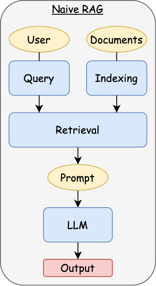
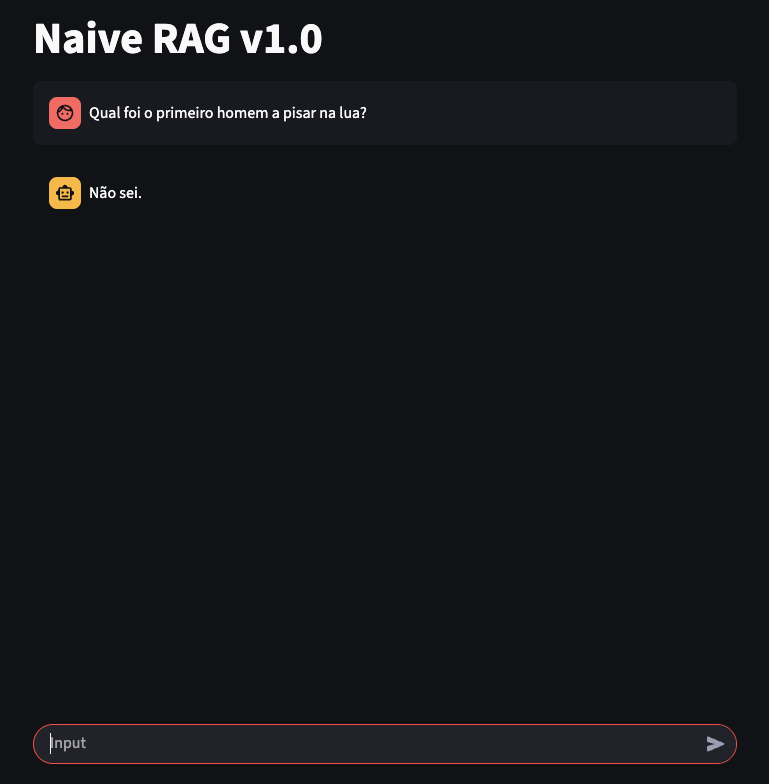
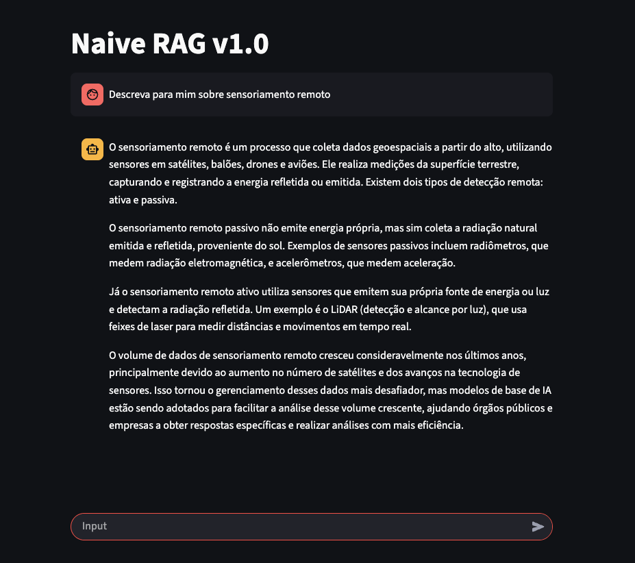

#### Naive RAG Walkthrough
This is a step-by-tep of how to create a Naive RAG (Retrieval-Augmented Generation) using LangChain and Groq API. The term "Naive" here means "This is the minimum a RAG should have", so this refers a initial approach to integrate retrieval with LLMs without complex filtering, scoring strategies or indexing.

Requirements:
- langchain (the main framework)
- langchain-core
- langchain-community
- langchain-groq (to access the Groq API)
- langchain-qdrant (to handle QDrant Vector Store via LangChain)
- qdrant_client (to create a QDrant client and collections)
- sentence-transformers (to use BERT to encode the input text)

#### BERT
The BERT (Bidirectional Encoder Representation of Transformers) uses multiple transformer-based enconding layers from transformers to represent the input text in vectors. In other words, will use for Embedding and then store in the QDrant Collection each encoded text. This step is very important because the encoded text (vector) will be used to search a similarity between the input and the retrieval data. The method used for it is the Cosine Similarity, which is a metric used to determine how similar two vectors are.

#### Embedding
Embeddings are a fundamental concept in Machine Learning and Natural Language Processing. They are mathematical representations of data in the form of vectors, in this case, entire sentences or texts are transformed into a single embedding vector using a pre-trained model, such as BERT or any SentenceTransformer-compatible encoder. To do this, the text extracted from documents is split into smaller chunks on a fixed number of character or tokens, and each chunk is an embedding vector. This step is essential to preserve context.

#### Architecture
The Naive RAG follows these steps:

    

#### Run
This project is designed to run in Docker, without data flow or run scripts, so the first time you run it, you'll need to perform a few steps:
- First, you must create a `.env` file on root directory of the project containing your Groq API key (you must get it from Groq website). The environment variable must follows this template: `GROQ_API_KEY=your_api_key`.
1. Uses the Python 3.12 bin and execute: **$ python3 -m venv .venv**
2. Then activate: **$ source .venv/bin/activate**
3. Install dependencies: **$ python3 -m pip install --upgrade pip && pip install -r requirements.txt**
4. Run only QDrant service: **$ docker-compose up -d 'qdrant'**
5. Execute the app with new document flag: **$ python3 src/app.py --use_new_document document.txt**
6. After stored the data in the vector store, start all services using: **$ docker-compose up -d**
7. Open your browser and enter the link `http://localhost:8501` and wait for the application to laucnh

If it's not first time, just run it:
1. **$ docker-compose up -d**
2. Open the link `http://localhost:8501` in your browser

For more container informations, use the `logs` from docker:
- RAG: **$ docker logs rag**
- QDrant: **$ docker logs qdrant**

#### Results
This is a test in which the query does not satisfy the context:

    

This is a test in which the query satisfy the context:

    

